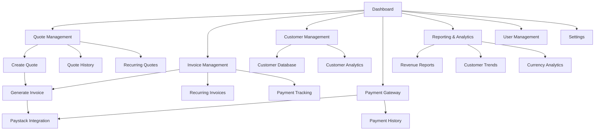

# Proforma Invoice Management System - Product Requirements Document

## 1. Product Overview

A comprehensive proforma invoice management system designed for businesses to create quotes, manage customers, generate invoices, and handle recurring billing with integrated payment processing. The system provides multi-user support with role-based permissions, multi-currency capabilities, and detailed reporting for business intelligence.

The product solves the challenge of manual invoice management by automating quote-to-invoice workflows, enabling direct payment collection, and providing insights into business performance through analytics and reporting.

## 2. Core Features

### 2.1 User Roles

| Role | Registration Method | Core Permissions |
|------|---------------------|------------------|
| Admin | Email registration (first user becomes admin) | Full system access, user management, settings configuration, financial reports |
| Sales User | Invitation by admin | Create/edit quotes and invoices, manage customers, view own sales reports |
| Viewer | Invitation by admin | Read-only access to quotes, invoices, and basic reports |

### 2.2 Feature Module

Our enhanced proforma invoice system consists of the following main pages:

1. **Dashboard**: Overview metrics, recent activities, revenue charts, outstanding payments summary
2. **Quote Management**: Create quotes, quote history, quote templates, recurring quote setup
3. **Invoice Management**: Generate invoices from quotes, invoice history, recurring invoice management, payment tracking
4. **Customer Management**: Customer database, customer payment history, customer analytics
5. **Payment Gateway**: Payment processing integration, payment status tracking, payment history
6. **Reporting & Analytics**: Revenue reports, customer trends, outstanding payments, currency conversion reports
7. **User Management**: User roles and permissions, team member invitations, access control
8. **Settings**: Company profile, currency settings, payment gateway configuration, PDF templates

### 2.3 Page Details

| Page Name | Module Name | Feature description |
|-----------|-------------|---------------------|
| Dashboard | Overview Metrics | Display total revenue, outstanding payments, recent quotes/invoices count with period comparisons |
| Dashboard | Activity Feed | Show recent customer activities, payment notifications, and system updates |
| Dashboard | Revenue Charts | Visualize monthly/quarterly revenue trends with multi-currency support |
| Quote Management | Quote Creation | Create detailed quotes with line items, tax calculations, validity periods, and customer selection |
| Quote Management | Quote Templates | Save and reuse common quote structures for faster quote generation |
| Quote Management | Recurring Quotes | Set up automated quote generation with customizable intervals (weekly, monthly, quarterly) |
| Quote Management | Quote History | Browse, search, and filter all quotes with status tracking and conversion rates |
| Invoice Management | Invoice Generation | Convert quotes to invoices or create standalone invoices with automatic numbering |
| Invoice Management | Recurring Invoices | Configure automatic invoice generation for regular clients with flexible scheduling |
| Invoice Management | Payment Tracking | Monitor payment status, send payment reminders, and track payment history |
| Invoice Management | Invoice Templates | Customize invoice layouts and branding with multiple PDF template options |
| Customer Management | Customer Database | Store customer information, contact details, billing addresses, and payment preferences |
| Customer Management | Customer Analytics | View customer payment history, average order value, and payment behavior patterns |
| Customer Management | Customer Communication | Send quotes/invoices via email with customizable templates and tracking |
| Payment Gateway | Paystack Integration | Process payments directly through Paystack for South African market with ZAR support |
| Payment Gateway | Payment Status | Real-time payment status updates, failed payment handling, and retry mechanisms |
| Payment Gateway | Payment History | Comprehensive payment logs with transaction details and reconciliation tools |
| Reporting & Analytics | Revenue Reports | Generate detailed revenue reports by period, customer, currency with export capabilities |
| Reporting & Analytics | Outstanding Payments | Track overdue invoices, aging reports, and collection analytics |
| Reporting & Analytics | Customer Trends | Analyze customer behavior, repeat business rates, and growth patterns |
| Reporting & Analytics | Currency Analytics | Multi-currency revenue tracking with conversion rates and regional performance |
| User Management | Role Management | Create and assign user roles with granular permission controls |
| User Management | Team Invitations | Invite team members via email with role assignment and onboarding workflow |
| User Management | Access Control | Monitor user activities, session management, and security settings |
| Settings | Company Profile | Configure company information, branding, tax settings, and contact details |
| Settings | Currency Configuration | Set primary currency, enable multi-currency support, and configure exchange rates |
| Settings | Payment Gateway Setup | Configure Paystack API keys, webhook endpoints, and payment methods |
| Settings | PDF Templates | Customize invoice/quote templates with company branding and layout options |

## 3. Core Process

### Admin Flow
1. Admin sets up company profile and payment gateway integration
2. Admin configures currency settings and PDF templates
3. Admin invites team members and assigns roles
4. Admin monitors overall business performance through analytics dashboard
5. Admin manages system settings and user permissions

### Sales User Flow
1. Sales user creates customer profiles with billing information
2. Sales user generates quotes using templates or custom line items
3. Sales user sends quotes to customers via email
4. Upon quote acceptance, sales user converts quote to invoice
5. Sales user tracks payment status and follows up on overdue invoices
6. Sales user sets up recurring invoices for regular clients

### Customer Payment Flow
1. Customer receives invoice via email with payment link
2. Customer clicks payment link and is redirected to Paystack payment page
3. Customer completes payment using preferred method (card, bank transfer, etc.)
4. System automatically updates invoice status upon successful payment
5. Customer and sales user receive payment confirmation notifications

## 4. User Interface Design

### 4.1 Design Style

- **Primary Colors**: Blue (#2563eb) for primary actions, Green (#10b981) for success states
- **Secondary Colors**: Gray (#6b7280) for text, Red (#ef4444) for errors, Yellow (#f59e0b) for warnings
- **Button Style**: Rounded corners (8px), subtle shadows, hover animations with color transitions
- **Font**: Inter or system fonts, 14px base size, 16px for headings, 12px for captions
- **Layout Style**: Card-based design with clean spacing, top navigation with sidebar for main sections
- **Icons**: Lucide React icons for consistency, 20px standard size, 16px for inline elements

### 4.2 Page Design Overview

| Page Name | Module Name | UI Elements |
|-----------|-------------|-------------|
| Dashboard | Overview Cards | Grid layout with metric cards, blue accent borders, white backgrounds with subtle shadows |
| Dashboard | Charts | Line and bar charts with blue/green color scheme, responsive design for mobile |
| Quote Management | Form Layout | Two-column layout, left side for customer/quote details, right side for line items and totals |
| Quote Management | Data Tables | Sortable columns, pagination, search filters, status badges with color coding |
| Invoice Management | Status Indicators | Color-coded status badges (green=paid, yellow=pending, red=overdue) |
| Payment Gateway | Payment Forms | Secure form styling with Paystack branding, progress indicators for payment flow |
| Reporting | Interactive Charts | Responsive charts with drill-down capabilities, export buttons, date range selectors |
| Settings | Tabbed Interface | Organized settings in tabs, form validation with inline error messages |

### 4.3 Responsiveness

The application is designed mobile-first with responsive breakpoints at 768px (tablet) and 1024px (desktop). Touch-optimized interactions for mobile devices with larger tap targets and swipe gestures for navigation. Sidebar collapses to hamburger menu on mobile devices.