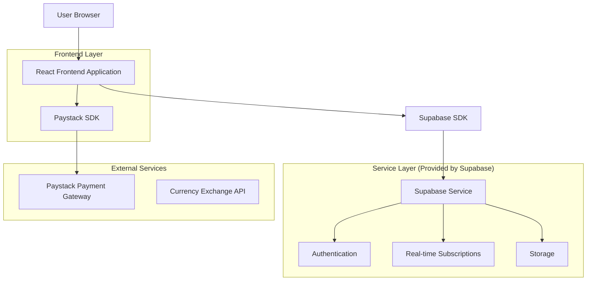
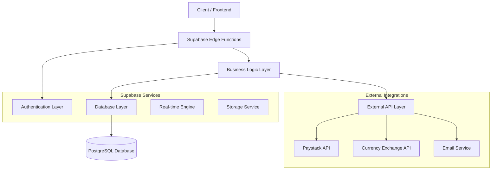
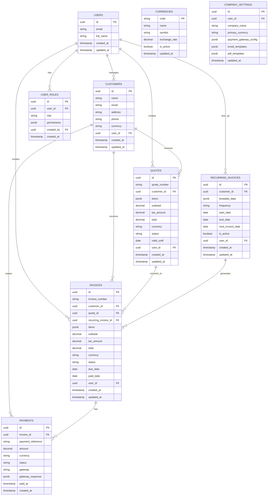

# Proforma Invoice Management System - Technical Architecture Document

## 1. Architecture Design



## 2. Technology Description

* **Frontend**: React\@18 + TypeScript\@5 + Tailwind CSS\@3 + Vite\@5

* **Backend**: Supabase (PostgreSQL + Auth + Real-time + Storage)

* **Payment Processing**: Paystack SDK for South African market

* **Additional Libraries**:

  * Lucide React (icons)

  * Date-fns (date manipulation)

  * React Beautiful DnD (drag & drop)

  * Chart.js or Recharts (analytics charts)

  * jsPDF (PDF generation)

## 3. Route Definitions

| Route                | Purpose                                                      |
| -------------------- | ------------------------------------------------------------ |
| /                    | Dashboard - main overview with metrics and recent activities |
| /quotes              | Quote management - create, edit, and view quotes             |
| /quotes/new          | Create new quote form                                        |
| /quotes/:id          | View/edit specific quote                                     |
| /invoices            | Invoice management - view and manage all invoices            |
| /invoices/new        | Create new invoice form                                      |
| /invoices/:id        | View/edit specific invoice                                   |
| /customers           | Customer management - customer database and analytics        |
| /customers/:id       | Individual customer profile and history                      |
| /payments            | Payment gateway integration and payment history              |
| /reports             | Reporting and analytics dashboard                            |
| /reports/revenue     | Revenue reports with filtering options                       |
| /reports/customers   | Customer analytics and trends                                |
| /users               | User management and role assignment (admin only)             |
| /settings            | System settings and configuration                            |
| /settings/company    | Company profile and branding                                 |
| /settings/payments   | Payment gateway configuration                                |
| /settings/currencies | Multi-currency settings                                      |

## 4. API Definitions

### 4.1 Core API

**Recurring Invoice Management**

```
POST /api/recurring-invoices
```

Request:

| Param Name     | Param Type | isRequired | Description                                 |
| -------------- | ---------- | ---------- | ------------------------------------------- |
| customer\_id   | string     | true       | UUID of the customer                        |
| template\_data | object     | true       | Invoice template with line items            |
| frequency      | string     | true       | 'weekly', 'monthly', 'quarterly', 'yearly'  |
| start\_date    | string     | true       | ISO date string for first invoice           |
| end\_date      | string     | false      | ISO date string for last invoice (optional) |
| is\_active     | boolean    | true       | Whether the recurring invoice is active     |

Response:

| Param Name          | Param Type | Description                                |
| ------------------- | ---------- | ------------------------------------------ |
| id                  | string     | UUID of created recurring invoice          |
| next\_invoice\_date | string     | ISO date string for next scheduled invoice |
| status              | string     | 'active', 'paused', 'completed'            |

**Payment Processing**

```
POST /api/payments/initialize
```

Request:

| Param Name      | Param Type | isRequired | Description                    |
| --------------- | ---------- | ---------- | ------------------------------ |
| invoice\_id     | string     | true       | UUID of the invoice to pay     |
| amount          | number     | true       | Payment amount in cents        |
| currency        | string     | true       | Currency code (ZAR, USD, etc.) |
| customer\_email | string     | true       | Customer email for payment     |

Response:

| Param Name   | Param Type | Description                    |
| ------------ | ---------- | ------------------------------ |
| payment\_url | string     | Paystack payment page URL      |
| reference    | string     | Payment reference for tracking |
| access\_code | string     | Paystack access code           |

**Multi-currency Support**

```
GET /api/exchange-rates
```

Response:

| Param Name     | Param Type | Description                             |
| -------------- | ---------- | --------------------------------------- |
| base\_currency | string     | Primary business currency               |
| rates          | object     | Exchange rates for supported currencies |
| last\_updated  | string     | ISO timestamp of last rate update       |

**User Role Management**

```
POST /api/users/invite
```

Request:

| Param Name  | Param Type | isRequired | Description                     |
| ----------- | ---------- | ---------- | ------------------------------- |
| email       | string     | true       | Email address of user to invite |
| role        | string     | true       | 'admin', 'sales', 'viewer'      |
| permissions | array      | false      | Custom permission overrides     |

Response:

| Param Name     | Param Type | Description                           |
| -------------- | ---------- | ------------------------------------- |
| invitation\_id | string     | UUID of the invitation                |
| expires\_at    | string     | ISO timestamp when invitation expires |
| status         | string     | 'sent', 'pending', 'accepted'         |

## 5. Server Architecture Diagram



## 6. Data Model

### 6.1 Data Model Definition



### 6.2 Data Definition Language

**User Roles Table**

```sql
-- Create user_roles table
CREATE TABLE user_roles (
    id UUID PRIMARY KEY DEFAULT gen_random_uuid(),
    user_id UUID NOT NULL REFERENCES auth.users(id) ON DELETE CASCADE,
    role VARCHAR(20) NOT NULL CHECK (role IN ('admin', 'sales', 'viewer')),
    permissions JSONB DEFAULT '{}',
    created_by UUID REFERENCES auth.users(id),
    created_at TIMESTAMP WITH TIME ZONE DEFAULT NOW(),
    updated_at TIMESTAMP WITH TIME ZONE DEFAULT NOW(),
    UNIQUE(user_id)
);

-- Create index
CREATE INDEX idx_user_roles_user_id ON user_roles(user_id);
CREATE INDEX idx_user_roles_role ON user_roles(role);
```

**Recurring Invoices Table**

```sql
-- Create recurring_invoices table
CREATE TABLE recurring_invoices (
    id UUID PRIMARY KEY DEFAULT gen_random_uuid(),
    customer_id UUID NOT NULL REFERENCES customers(id) ON DELETE CASCADE,
    template_data JSONB NOT NULL,
    frequency VARCHAR(20) NOT NULL CHECK (frequency IN ('weekly', 'monthly', 'quarterly', 'yearly')),
    start_date DATE NOT NULL,
    end_date DATE,
    next_invoice_date DATE NOT NULL,
    is_active BOOLEAN DEFAULT true,
    user_id UUID NOT NULL REFERENCES auth.users(id) ON DELETE CASCADE,
    created_at TIMESTAMP WITH TIME ZONE DEFAULT NOW(),
    updated_at TIMESTAMP WITH TIME ZONE DEFAULT NOW()
);

-- Create indexes
CREATE INDEX idx_recurring_invoices_customer_id ON recurring_invoices(customer_id);
CREATE INDEX idx_recurring_invoices_user_id ON recurring_invoices(user_id);
CREATE INDEX idx_recurring_invoices_next_date ON recurring_invoices(next_invoice_date);
CREATE INDEX idx_recurring_invoices_active ON recurring_invoices(is_active);
```

**Payments Table**

```sql
-- Create payments table
CREATE TABLE payments (
    id UUID PRIMARY KEY DEFAULT gen_random_uuid(),
    invoice_id UUID NOT NULL REFERENCES invoices(id) ON DELETE CASCADE,
    payment_reference VARCHAR(255) UNIQUE NOT NULL,
    amount DECIMAL(10,2) NOT NULL,
    currency VARCHAR(3) NOT NULL DEFAULT 'ZAR',
    status VARCHAR(20) NOT NULL DEFAULT 'pending' CHECK (status IN ('pending', 'successful', 'failed', 'cancelled')),
    gateway VARCHAR(50) NOT NULL DEFAULT 'paystack',
    gateway_response JSONB,
    paid_at TIMESTAMP WITH TIME ZONE,
    created_at TIMESTAMP WITH TIME ZONE DEFAULT NOW()
);

-- Create indexes
CREATE INDEX idx_payments_invoice_id ON payments(invoice_id);
CREATE INDEX idx_payments_reference ON payments(payment_reference);
CREATE INDEX idx_payments_status ON payments(status);
CREATE INDEX idx_payments_created_at ON payments(created_at DESC);
```

**Currencies Table**

```sql
-- Create currencies table
CREATE TABLE currencies (
    code VARCHAR(3) PRIMARY KEY,
    name VARCHAR(100) NOT NULL,
    symbol VARCHAR(10) NOT NULL,
    exchange_rate DECIMAL(10,6) NOT NULL DEFAULT 1.0,
    is_active BOOLEAN DEFAULT true,
    updated_at TIMESTAMP WITH TIME ZONE DEFAULT NOW()
);

-- Insert initial currency data
INSERT INTO currencies (code, name, symbol, exchange_rate, is_active) VALUES
('ZAR', 'South African Rand', 'R', 1.0, true),
('USD', 'US Dollar', '$', 0.055, true),
('EUR', 'Euro', '€', 0.051, true),
('GBP', 'British Pound', '£', 0.044, true);
```

**Company Settings Table**

```sql
-- Create company_settings table
CREATE TABLE company_settings (
    id UUID PRIMARY KEY DEFAULT gen_random_uuid(),
    user_id UUID NOT NULL REFERENCES auth.users(id) ON DELETE CASCADE,
    company_name VARCHAR(255) NOT NULL,
    primary_currency VARCHAR(3) NOT NULL DEFAULT 'ZAR' REFERENCES currencies(code),
    payment_gateway_config JSONB DEFAULT '{}',
    email_templates JSONB DEFAULT '{}',
    pdf_templates JSONB DEFAULT '{}',
    created_at TIMESTAMP WITH TIME ZONE DEFAULT NOW(),
    updated_at TIMESTAMP WITH TIME ZONE DEFAULT NOW(),
    UNIQUE(user_id)
);

-- Create index
CREATE INDEX idx_company_settings_user_id ON company_settings(user_id);
```

**Enhanced Customers Table**

```sql
-- Add currency support to existing customers table
ALTER TABLE customers ADD COLUMN IF NOT EXISTS currency VARCHAR(3) DEFAULT 'ZAR' REFERENCES currencies(code);
ALTER TABLE customers ADD COLUMN IF NOT EXISTS payment_terms INTEGER DEFAULT 30;
ALTER TABLE customers ADD COLUMN IF NOT EXISTS credit_limit DECIMAL(10,2);

-- Create index for currency
CREATE INDEX IF NOT EXISTS idx_customers_currency ON customers(currency);
```

**Enhanced Invoices Table**

```sql
-- Add currency and recurring invoice support to existing invoices table
ALTER TABLE invoices ADD COLUMN IF NOT EXISTS currency VARCHAR(3) DEFAULT 'ZAR' REFERENCES currencies(code);
ALTER TABLE invoices ADD COLUMN IF NOT EXISTS recurring_invoice_id UUID REFERENCES recurring_invoices(id);
ALTER TABLE invoices ADD COLUMN IF NOT EXISTS exchange_rate DECIMAL(10,6) DEFAULT 1.0;

-- Create indexes
CREATE INDEX IF NOT EXISTS idx_invoices_currency ON invoices(currency);
CREATE INDEX IF NOT EXISTS idx_invoices_recurring_id ON invoices(recurring_invoice_id);
```

**Enhanced Quotes Table**

```sql
-- Add currency support to existing quotes table
ALTER TABLE quotes ADD COLUMN IF NOT EXISTS currency VARCHAR(3) DEFAULT 'ZAR' REFERENCES currencies(code);
ALTER TABLE quotes ADD COLUMN IF NOT EXISTS exchange_rate DECIMAL(10,6) DEFAULT 1.0;

-- Create index
CREATE INDEX IF NOT EXISTS idx_quotes_currency ON quotes(currency);
```

